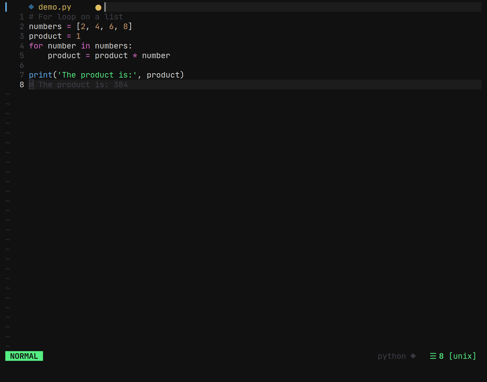
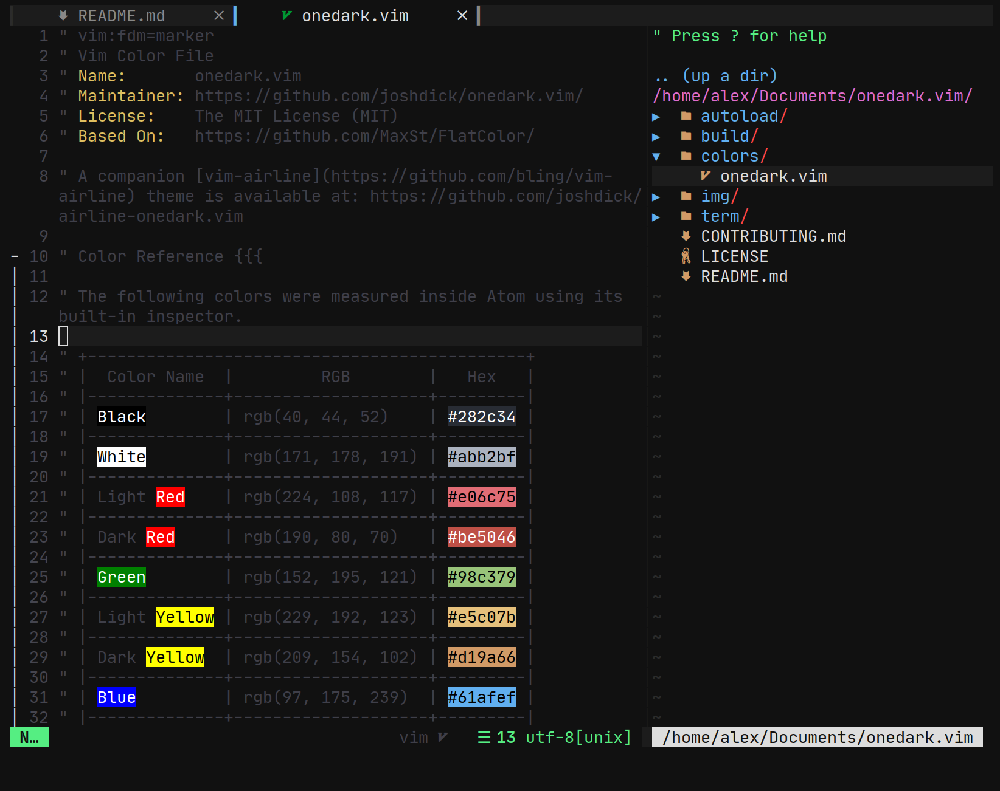

# **This is a fork**

I'm keeping the parts of the original README here as I can't be bothered to change it but this is a fork of _The_ **Ultimate** **_vimrc_**, I've adapted it to fit my more IDe oriented needs, colorscheme and as the name implies, neovim.

# The Ultimate Neovim config

I've had a weird history with Vim and Neovim. I started off with Christian Chiarulli's Neovim config, but I didn't understand it well. Then I moved to this config and forked it. I don't want to compete with Cristian's config, but it's a definate inspiration, specifically the general usability. I differ in the fact that I want something more understandable and small than a config that can do everything.

I have an install script but I haven't tested it, good luck!
If it's totally broken please make an issue

`bash <(curl -s https://raw.githubusercontent.com/antaxiom/nvimrc/master/utils/install.sh)`

I use Vim plugged here (instead of the original pathogen from this fork

Naturally, `/opt/vim_runtime` can be any directory, as long as all the users specified have read access.

## Fonts

I recommend using [JetBrains Mono](https://www.jetbrains.com/lp/mono/) [Nerd Font Version](https://www.nerdfonts.com/) (it's an open-source and awesome font that can make your code beautiful).

Some other fonts that Awesome will try to use:

- [Source Code Pro](https://adobe-fonts.github.io/source-code-pro/)
- [Fira Code](https://github.com/tonsky/FiraCode)

## How to install on Windows?

Don't use Neovim on windows, lol

## How to install on Linux

Have Neovim, run the script, pray it works

## How to update to latest version?

Just do a git rebase!

```
    cd ~/.config/nvim/
    git pull --rebase
    # Open nvim and run
    :PlugUpdate
```

If you want to remove plugins that aren't in use anymore from an older version of the config run

`:PlugClean`

## Some screenshots

Colors when editing a Python file:



[NERD Tree](https://github.com/scrooloose/nerdtree) plugin in a terminal window:


Distraction free mode using [goyo.vim](https://github.com/junegunn/goyo.vim) and [limelight.vim](https://github.com/junegunn/limelight.vim):


## Included Plugins

This will get out of date fast so just read `vimrcs/plug.vim`, that's where all the plugins are

I recommend reading the docs of these plugins to understand them better. Each plugin provides a much better Vim experience!

## Included color schemes

- "Onedark" (Too Dark): Internally referred to as onedark, but is a fork. As the name implies it's "too dark"

## How to include your own stuff?

Feel free to modify all of the sourced files in `vimrcs/*` and source more in `init.vim`

```vim
    map <leader>ct :cd ~/Desktop/Todoist/todoist<cr>
    map <leader>cw :cd ~/Desktop/Wedoist/wedoist<cr>
```

You can also install your plugins, for instance, via pathogen you can install [vim-rails](https://github.com/tpope/vim-rails):

```bash
    nvim ~/.config/nvim/vimrcs/plug.vim
    # Add
    Plug 'tpope/vim-rails'
```

## Key Mappings

The [leader](http://learnvimscriptthehardway.stevelosh.com/chapters/06.html#leader) is `,`, so whenever you see `<leader>` it means `,`.

### Normal mode mappings

Fast saving of a buffer (`<leader>w`):

```vim
    nmap <leader>w :w!<cr>
```

Disable highlights when you press `<Asc>`:

```vim
    map <silent> <Esc> :noh<cr>
```

Smart way to move between windows (`<ctrl>j` etc.):

```vim
    map <C-j> <C-W>j
    map <C-k> <C-W>k
    map <C-h> <C-W>h
    map <C-l> <C-W>l
```

Useful mappings for managing tabs:

_Refer to the bindings for barbar.nvim in_ `vimrcs/plugins_config.vim`

Switch [CWD](http://vim.wikia.com/wiki/Set_working_directory_to_the_current_file) to the directory of the open buffer:

```vim
    map <leader>cd :cd %:p:h<cr>:pwd<cr>
```

Quickly open a buffer for scribble:

```vim
    map <leader>q :e ~/buffer<cr>
```

### Visual mode mappings

Visual mode pressing `*` or `#` searches for the current selection:

```vim
    vnoremap <silent> * :call VisualSelection('f')<CR>
    vnoremap <silent> # :call VisualSelection('b')<CR>
```

When you press `<leader>R` you can search and replace the selected text:

```vim
    vnoremap <silent> <leader>R :call VisualSelection('replace')<CR>
```

Surround the visual selection in parenthesis/brackets/etc.:

```vim
    vnoremap $1 <esc>`>a)<esc>`<i(<esc>
    vnoremap $2 <esc>`>a]<esc>`<i[<esc>
    vnoremap $3 <esc>`>a}<esc>`<i{<esc>
    vnoremap $$ <esc>`>a"<esc>`<i"<esc>
    vnoremap $q <esc>`>a'<esc>`<i'<esc>
    vnoremap $e <esc>`>a`<esc>`<i`<esc>
```

### Insert mode mappings

Quickly insert parenthesis/brackets/etc.:

```vim
    inoremap $1 ()<esc>i
    inoremap $2 []<esc>i
    inoremap $3 {}<esc>i
    inoremap $4 {<esc>o}<esc>O
    inoremap $q ''<esc>i
    inoremap $e ""<esc>i
    inoremap $t <><esc>i
```

Insert the current date and time (useful for timestamps):

```vim
    iab xdate <C-r>=strftime("%d/%m/%y %H:%M:%S")<cr>
```

### Command line mappings

$q is super useful when browsing on the command line. It deletes everything until the last slash:

```vim
    cno $q <C-\>eDeleteTillSlash()<cr>
```

Bash like keys for the command line:

```vim
    cnoremap <C-A>		<Home>
    cnoremap <C-E>		<End>
    cnoremap <C-K>		<C-U>

    cnoremap <C-P> <Up>
    cnoremap <C-N> <Down>
```

Write the file as sudo (works only on Unix 😎). Super useful when you open a file and you don't have permissions to save your changes. [Vim tip](http://vim.wikia.com/wiki/Su-write):

```vim
    :W
```

### Plugin related mappings

Open [bufexplorer](https://github.com/vim-scripts/bufexplorer.zip) to see and manage the current buffers (`<leader>o`):

```vim
    map <leader>o :BufExplorer<cr>
```

Open [ctrlp.vim](https://github.com/kien/ctrlp.vim) plugin to quickly find a file or a buffer (`<leader>j` or `<ctrl>f`):

```vim
    " Quickly find and open a file in the CWD
    let g:ctrlp_map = '<C-f>'

    " Quickly find and open a recently opened file
    map <leader>f :MRU<CR>

    " Quickly find and open a buffer
    map <leader>b :CtrlPBuffer<cr>
```

[NERD Tree](https://github.com/scrooloose/nerdtree) mappings:

```vim
    map <leader>nn :NERDTreeToggle<cr>
    map <leader>nb :NERDTreeFromBookmark
    map <leader>nf :NERDTreeFind<cr>
```

[goyo.vim](https://github.com/junegunn/goyo.vim) and [limelight.vim](https://github.com/junegunn/limelight.vim) lets you only focus on one thing at a time. It removes all the distractions and centers the content. It only has one mapping. (`<leader>z`)

```vim
    map <leader>z :Goyo<cr>
```

[vim-multiple-cursors](https://github.com/terryma/vim-multiple-cursors) mappings to manage multiple cursors at once:

```vim
    let g:multi_cursor_start_word_key      = '<C-s>'
    let g:multi_cursor_select_all_word_key = '<A-s>'
    let g:multi_cursor_start_key           = 'g<C-s>'
    let g:multi_cursor_select_all_key      = 'g<A-s>'
    let g:multi_cursor_next_key            = '<C-s>'
    let g:multi_cursor_prev_key            = '<C-p>'
    let g:multi_cursor_skip_key            = '<C-x>'
    let g:multi_cursor_quit_key            = '<Esc>'
```

[vim-yankstack](https://github.com/maxbrunsfeld/vim-yankstack) mappings to manage the kill-ring (clipboard):

```vim
    nmap <C-p> <Plug>yankstack_substitute_older_paste
    nmap <C-n> <Plug>yankstack_substitute_newer_paste
```

[ctrl-p](https://github.com/ctrlpvim/ctrlp.vim) mappings to easily find and open a file, buffer, etc.:

```vim
    let g:ctrlp_map = '<C-f>'
    map <leader>j :CtrlP<cr>
    map <C-b> :CtrlPBuffer<cr>
```

[vim-snipmate](https://github.com/garbas/vim-snipmate) mappings to autocomplete via snippets:

```vim
    ino <C-j> <C-r>=snipMate#TriggerSnippet()<cr>
    snor <C-j> <esc>i<right><C-r>=snipMate#TriggerSnippet()<cr>
```

[vim-surround](https://github.com/tpope/vim-surround) mappings to easily surround a string with `_()` gettext annotation:

```vim
    vmap Si S(i_<esc>f)
    au FileType mako vmap Si S"i${ _(<esc>2f"a) }<esc>
```

[ale](https://github.com/dense-analysis/ale) to easily go to the next Ale syntax/lint error:

```vim
    nmap <silent> <leader>a <Plug>(ale_next_wrap)
```

### Spell checking

Pressing `<leader>ss` will toggle spell checking:

```vim
    map <leader>ss :setlocal spell!<cr>
```

Shortcuts using `<leader>` instead of special characters:

```vim
    map <leader>sn ]s
    map <leader>sp [s
    map <leader>sa zg
    map <leader>s? z=
```

## How to uninstall

Just do following:

- Remove `~/.config/nvim/*`
